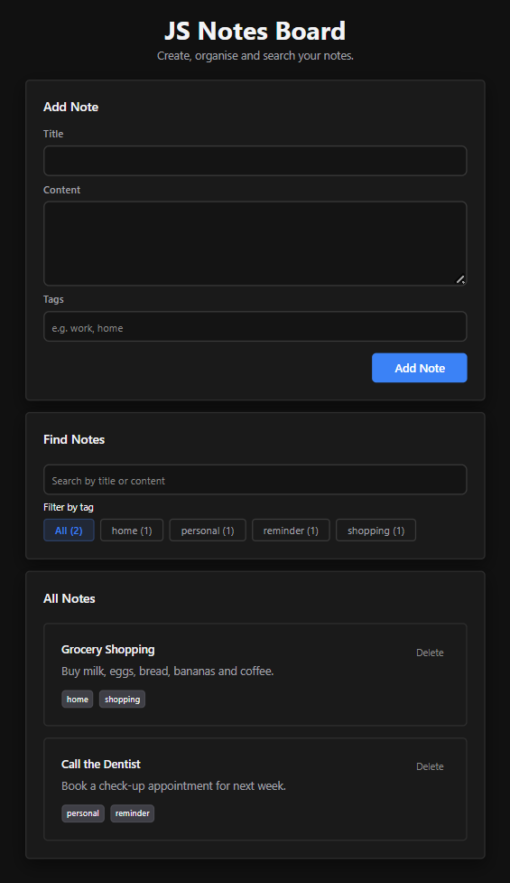

# JS Notes Board

A simple notes application built with **vanilla JavaScript, HTML and CSS**.

[Live Demo](https://js-notes-board.vercel.app/)

## Preview



## Features

- Add and delete notes
- Add tags to notes
- Filter notes by tag
- Search notes by title or content
- Debounced search
- Save notes in `localStorage`
- Event delegation for dynamically created elements

## Built With

- HTML
- CSS
- JavaScript
- Browser `localStorage`

## JavaScript Concepts Applied

- DOM manipulation
- Event listeners and event delegation
- Form handling
- Arrays and array methods
- Application state
- `localStorage`
- HTML templates
- Search, filtering and debouncing
- Separating application logic into smaller responsibilities

## Project Structure

```text
js-notes-board/
├── index.html
├── style.css
├── script.js
└── README.md
```

## Running Locally

Clone the repository:

```bash
git clone https://github.com/jassmin27/js-notes-board.git
```

Open the project in VS Code and run `index.html` using the **Live Server** extension.

## What I Learned

The main goal of this project was to understand how a JavaScript application can manage state, update the DOM and respond to user interactions without a framework.

It also gave me a stronger foundation for understanding what libraries such as React handle for us.

## Next Version

After completing the vanilla JavaScript version, I rebuilt the Notes Board using **React**, applying the same core ideas with components, state, effects, testing and asynchronous data handling.

[View the React version](https://github.com/jassmin27/react-notes-board)
